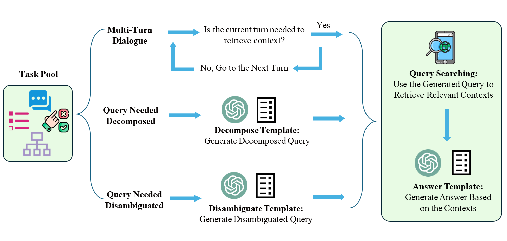

# RQ-RAG: Learning to Refine Queries for Retrieval Augmented Generation

This is the repo of our paper "RQ-RAG: Learning to Refine Queries for Retrieval Augmented Generation"


## Getting Start

---

1. Installation

Clone this repository first, and install the dependencies.

```
git clone git@github.com:chanchimin/RQ-RAG.git
cd RQ-RAG
pip install -r requirements.txt
```

2. Construct Search-Augmented Dataset

First, set up your openai api key
```
export OPENAI_API_KEY="your_api_key_here"
```

Second, preprocess your data to the following format

```python
# for multi-turn data， your data should contain messages format, an example:

{
    "id": ...,
    "messages":
        [
            {   
                "role":"user",
                "content": ...,
            },
            {
                "role":"assistant",
                "content": ...,
            }
        ]
}
```

Afterward, execute the following lines, make sure to substitute your data path.

```shell
cd ./data_creation_sag

python main_multiturn_answer_generate.py \
--raw_data_path_multiturn  \
"your file" \
--ndocs  \
3  \
--output_path  \
"your output_path" \
--search_engine_type  \
duckduckgo  \
--openai_api_key  \
"your key" \
--overwrite_output
```

After gathering the intermediate results, run:

```shell
python merge_intermediate.py \
--raw_data_path \
"intermediate data path" \
--output_path \
"final data output path"
```



3. Train the model
```shell
cd ..
bash retrieval_lm/scripts/train/script_finetune_7b.sh
```

4. Inference and Sample the results

```shell
# take hotpotqa as an example
# first inference the model, all the trajectory will be saved to "your_output_dir/final_results.json"
bash retrieval_lm/scripts/inference/search_engine/hotpotqa.sh
# then do the sample
bash retrieval_lm/scripts/sample_from_tree/hotpotqa.sh
```
